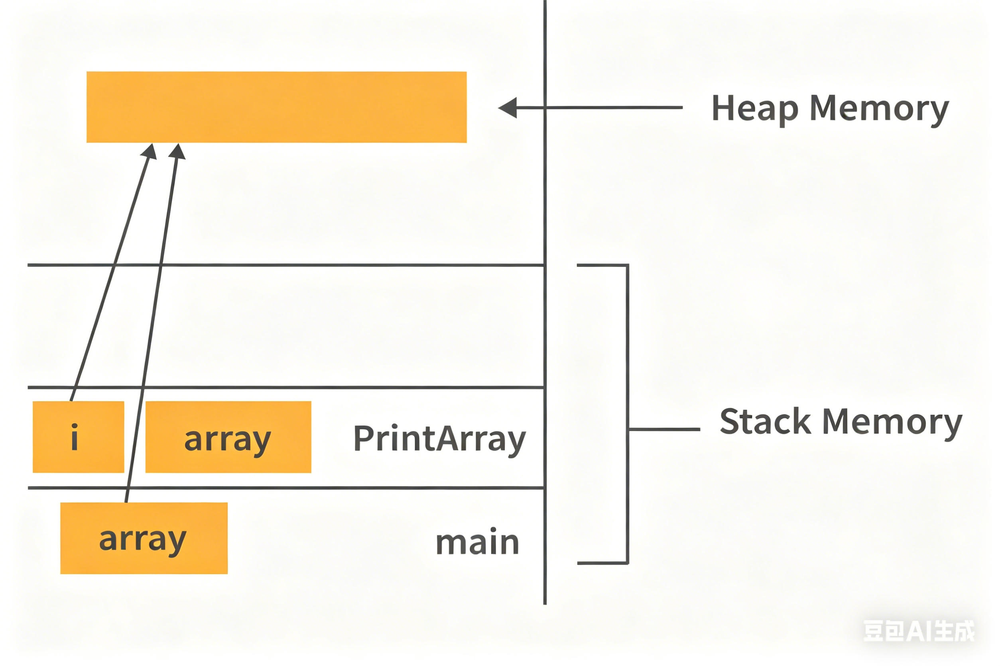

# Java Interview Questions for Freshers

---

## 1. Why is Java a platform independent language?

Java is designed to be hardware and software agnostic, which makes it platform independent:
- The Java compiler (`javac`) compiles source code into **bytecode**, a intermediate, platform-agnostic format.
- This bytecode is not machine-specific and can be executed on any system that has a compatible **Java Runtime Environment (JRE)** installed.
- The JRE's Java Virtual Machine (JVM) interprets or Just-In-Time (JIT) compiles the bytecode into native machine code at runtime, allowing the same program to run across different operating systems and hardware architectures.

---

## 2. Why is Java not a pure object oriented language?

Java is not a pure object-oriented language because it supports **primitive data types**, which are not objects:
- Primitives include: `byte`, `boolean`, `char`, `short`, `int`, `float`, `long`, and `double`.
- These are stored directly in memory (not as objects with methods/fields) and do not inherit from `java.lang.Object`, violating the pure OOP principle that "everything is an object".
- While wrapper classes (e.g., `Integer`, `Boolean`) exist to box primitives into objects, the language's native support for primitives prevents it from being classified as purely object-oriented.

---

## 3. Difference between Heap and Stack Memory in Java, and how Java utilizes them

### Key Differences
| Feature                | Stack Memory                          | Heap Memory                          |
|------------------------|---------------------------------------|--------------------------------------|
| **Allocation**         | Fixed size per thread/function call   | Dynamic, shared across the JVM        |
| **Lifetime**           | Tied to method execution scope        | Tied to object lifecycle (GC-managed)|
| **Storage**            | Primitive variables, method calls, references | Objects and their instance data |
| **Access Speed**       | Fast (LIFO access pattern)            | Slower (dynamic allocation)          |

### Java Memory Utilization Example

Consider the following program:
```java
class Main {
    public void printArray(int[] array) {
        for (int i : array)
            System.out.println(i);
    }

    public static void main(String args[]) {
        int[] array = new int[10];
        printArray(array);
    }
}
```



#### Memory Layout:
- **Stack Memory**:
  - Holds the `main()` and `printArray()` method frames.
  - Stores the `array` reference variable (in `main()`), the `array` parameter (in `printArray()`), and the loop variable `i` (in `printArray()`).
- **Heap Memory**:
  - Stores the actual `int[10]` array object created at runtime with `new int[10]`.
  - The `array` references on the stack point to this heap object.


*(The diagram shows method frames and references in the stack pointing to objects in the heap)*
